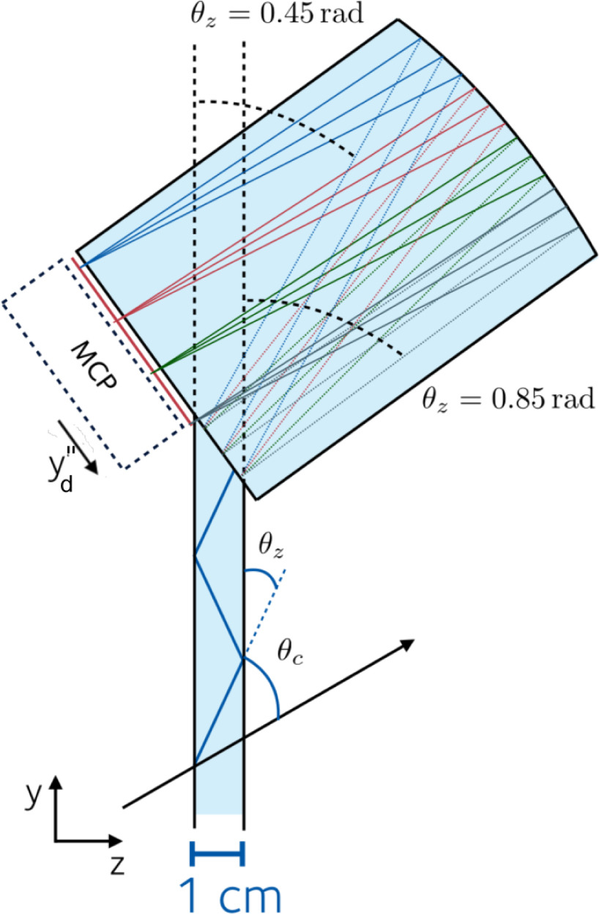

# TORCH Detector

## Introduction

The Time Of internally Reflected CHerenkov (TORCH) detector is a proposed large-area Time-Of-Flight (TOF) detector, which aims to enhance the PID performance of the LHCb detector in the 2–15 GeV/c momentum range [2]. TORCH exploits the difference in TOF between several species of particles with the same momentum.

Prompt Cherenkov photons are radiated when charged hadrons traverse a 10 mm-thick quartz plate. The Cherenkov photons are propagated, via total internal reflection, to the periphery of the radiator, where a cylindrical mirrored surface focuses them onto an array of fast-timing photon detectors. The cylindrical mirror is designed such that the position (height) in the MCP can be mapped to the entry angle of the photon in the focusing block, while in the direction, the photon is just reflected.

*Fig. 1: Side view of TORCH with the possible path of a Cherenkov photon emitted by a charged hadron. The diagram shows how Cherenkov light is internally reflected through the quartz plate before being focused onto the photon detectors by the cylindrical mirror.*

The full detector will comprise 18 optically isolated modules, each with a quartz radiator of 2.5 m height, 66 cm width and 1 cm depth, and a focusing block. The 18 radiator bars will cover an area of 5 × 6 m². TORCH will be installed in front of RICH2 of LHCb, at approx. 9.5 m from the interaction point.

## Reconstruction

The TORCH reconstruction process relies on photon detectors that measure both arrival time ($𝑡_{\text{arrival}}$) and position of Cherenkov photons. From these measurements, the azimuthal ($\phi_{C}$) and polar ($\theta_{C}$) Cherenkov angles and the photon path length in the radiator can be calculated.

The photon arrival time can be expressed as:

$$
t_{\text{arrival}} = t_0 + t_{\text{TOF}} + t_{\text{prop}}  \tag{1}
$$

where $t_0$ is the production time of the charged hadron, $t_{\text{TOF}}$ is the time of flight of the hadron before emitting the Cherenkov photon, and $t_{\text{prop}}$ is the propagation time of the photon to the detector.

The TOF can be determined using information from the tracking system as $𝑑_{\text{track}}/(\beta 𝑐)$, where $𝑑_{\text{track}}$ is the particle's path length and $\beta$ is calculated based on the particle mass hypothesis ($\pi$, $K$ or $p$). The production time $t_{0}$ can be derived either from TORCH information alone by combining likelihoods of tracks from the same vertex, or from the VELO detector's fast timing capabilities in LHCb Upgrade II.

The photon propagation time is calculated as $𝑡_{\text{prop}} = 𝑑_{\text{prop}}/𝑣_{\text{group}}$, where $𝑣_{\text{group}}$ is the group velocity dependent on photon energy. Due to the wavelength dependence of the quartz refractive index, chromatic dispersion occurs - photons with different energies from the same track are emitted at different Cherenkov angles. This effect can be corrected using the measured Cherenkov angle.

